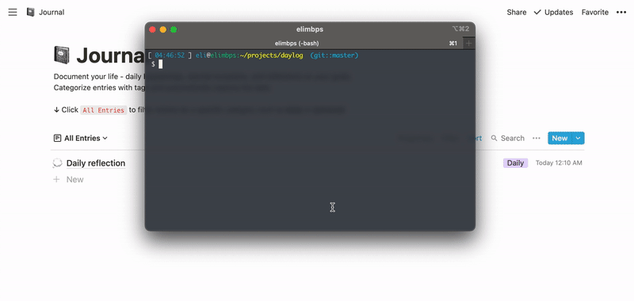
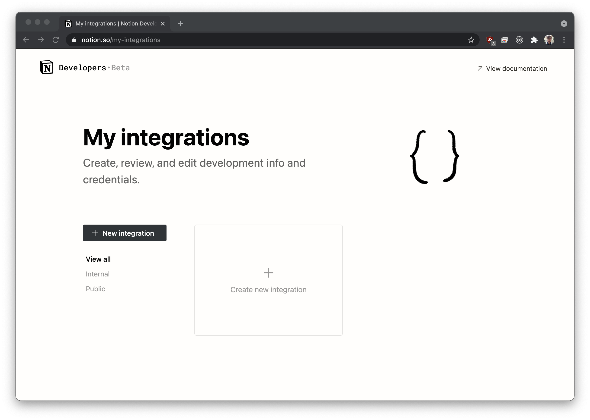
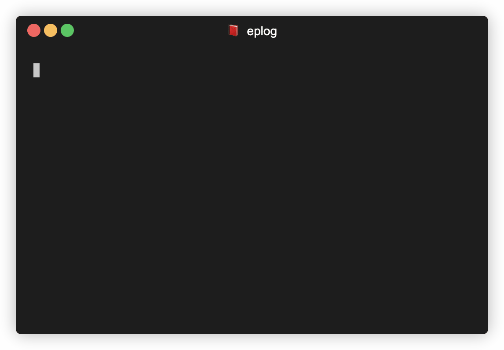

# 📕 eplog

CLI utility for creating documents in notion.so databases



## Installation

### Install locally

```bash
npm install -g eplog
```

### Use without installing

```bash
npx eplog
```

### Setup

#### Step 1

The first time you launch [eplog](https://npmjs.com/package/eplog) it will prompt you to provide it with an `Integration Token` which you can create in Notions' `My Integrations` section: https://www.notion.so/my-integrations

#### Step 2

Once you've created a new integration, copy the `Internal Integration Token` and provide it to eplog when asked during the setup process.

```bash
$ eplog
❯ Initialize Eplog
  ⠇ Notion API
  ◼ Enter API Key
  ◼ Select Default Database

? You do not have an API key (integration token) set up - would you like to set one up right now? (y/N) › false
```

You'll need to `Share` a database with this new integration, and once you do you will be able to configure eplog to use the database you shared.



You can share more than one database with the integration and use `-d` flag to save a new entry to the provided database.

## Usage



```bash
$ eplog --help
Usage: eplog [options] [command]

 ✎  Write down notion database rows from cli - use as a simple logging tool

Options:
  -V, --version             output the version number
  -l, --list                List avialable databases
  -u, --database [name]     Set default database (choices: "Daylog", "Testlog")
  -r, --reload              Reload databases
  -h, --help                display help for command

Commands:
  settings
  add [options] <title...>
```
### Adding a new entry

To add new entries simply type `eplog add [Your log entry]`:

```bash
$ eplog add This ismy first entry!

✔ Save "This is my first entry!" to Testlog
id: 421eecad-83a4-4cad-9c2e-20725d536842
time: 2021-05-22T23:42:42.564Z

properties:
.----------------------------------------.
| Tags        |                          |
| Description |                          |
| Created     | 2021-05-22T23:42:42.564Z |
| Name        | This is my first entry!  |
'----------------------------------------'
```

If you prefer a less noisy output you can configure eplog to use compact mode:

```bash
$ eplog settings set compact true
```

### Custom properties

Eplog will detect any properties in your database and will allow you to set them when creating a new entry.

To see the available properties for your default database run the `eplog add --help` command:

```bash
$ eplog add --help

Usage: eplog add [options] <title...>

Options:
  -l, --list                 List avialable databases
  -d, --database <database>  Select specific database (choices: "Daylog", "Testlog")
  --Tags <value>             Set the "Tags" field to <value> - (choices: Blue, Orange)
  --Description <value>      Set the "Description" field to <value>
  -h, --help                 display help for command
```

In this case my default database has `--Tags` (with choices of Blue and Orange), and a `--Description` options.

Example:

```bash
$ eplog add Notion is Awesome! --Tags Orange --Description "This is an amazing description"
✔ Save "Notion is Awesome!" to Testlog
id: 7c1d4f28-b77a-47e2-85f1-ca016228a55a
time: 2021-05-22T23:52:32.646Z

properties:
.----------------------------------------------.
| Tags        | Orange                         |
| Description | This is an amazing description |
| Created     | 2021-05-22T23:52:32.646Z       |
| Name        | Notion is Awesome!             |
'----------------------------------------------'
```

### Using a different database

If you've shared more than one database with the integration you can occasionally use the `--database <name>` flag (or the shorthand `-d <name>`) when adding a new entry.

> Note: Using a `-d` flag currently does not fully support additional properties

Example:

```bash
$ eplog add -d Mydb2 Adding this to another database...

✔ Save "Adding this to another database..." to Mydb2
id: ec1a24b1-bb44-5224-a92b-95a256cc365b
```

### Changing default database

Run `$ eplog -u [Database Name]` - optionally provide a database name.

```bash
$ eplog -u
```

### Compact mode

Set compact mode for a less noisy output:

```bash
$ eplog settings set compact true
```

# Reference

- Notion API: https://developers.notion.com/
- Notion "My Integrations": https://www.notion.so/my-integrations


